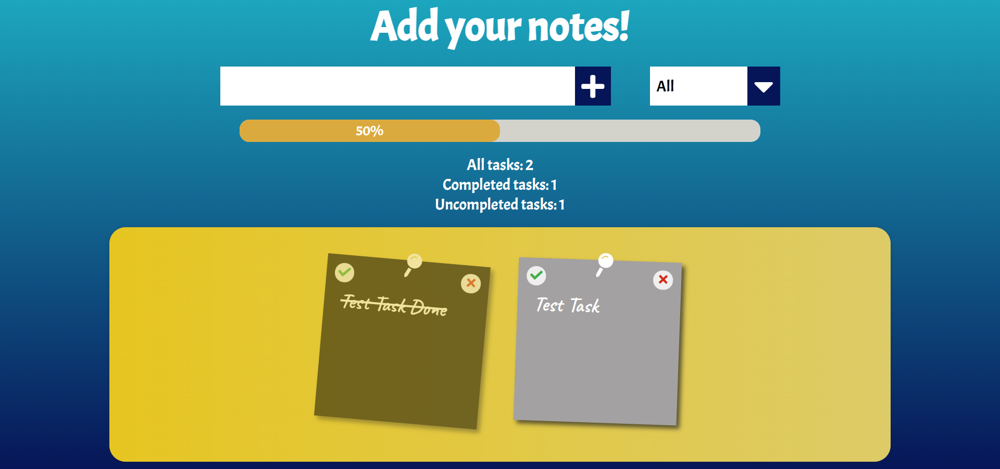

# Short Notes App


## Description:
"Short Notes App" is an app where you can add and delete your notes, mark them as finished or unfinished. You can also filter them based on that. To see the progress of your tasks you can use statistics and a bar that shows you in % how much you have left to do. All data is saved in local storage, so when you leave the page and enter it again it will remain saved.

## Live Demo
[Short Notes App - live preview](https://oszi91.github.io/ShortNotesApp/)

## Technologies and additional dependencies:
| Tool | Description |
| :-------------:|--------------|
| HTML5 | A markup language used for structuring, and presenting content on the World Wide Web. |
| CSS | A simple mechanism for adding style to Web documents. |
| Vanilla JavaScript | Pure JavaScript. |

## Installation:

-  ```git clone https://github.com/oszi91/ShortNotesApp.git``` to clone the repository and view the website in the browser.